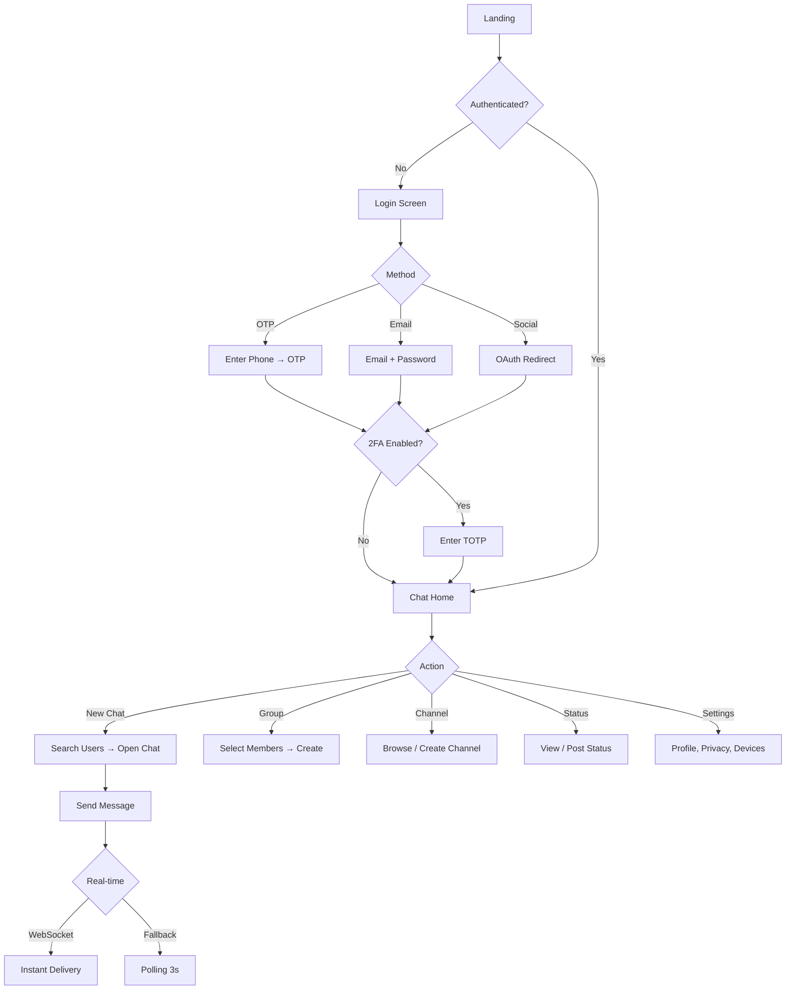
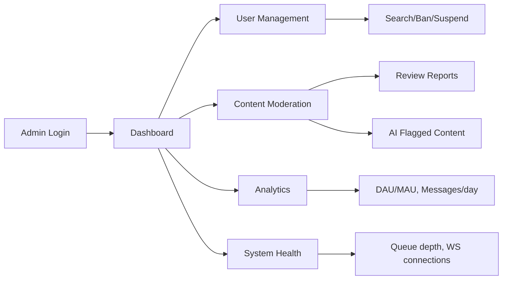
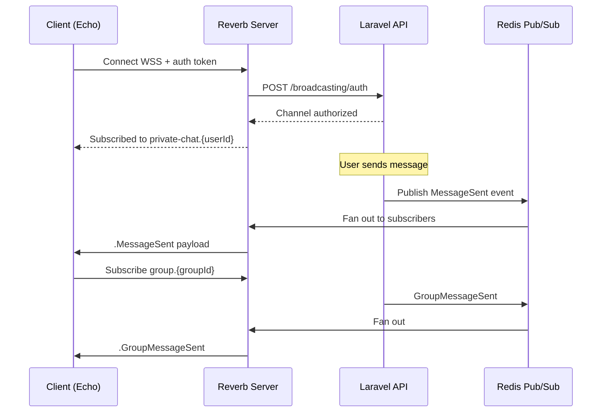
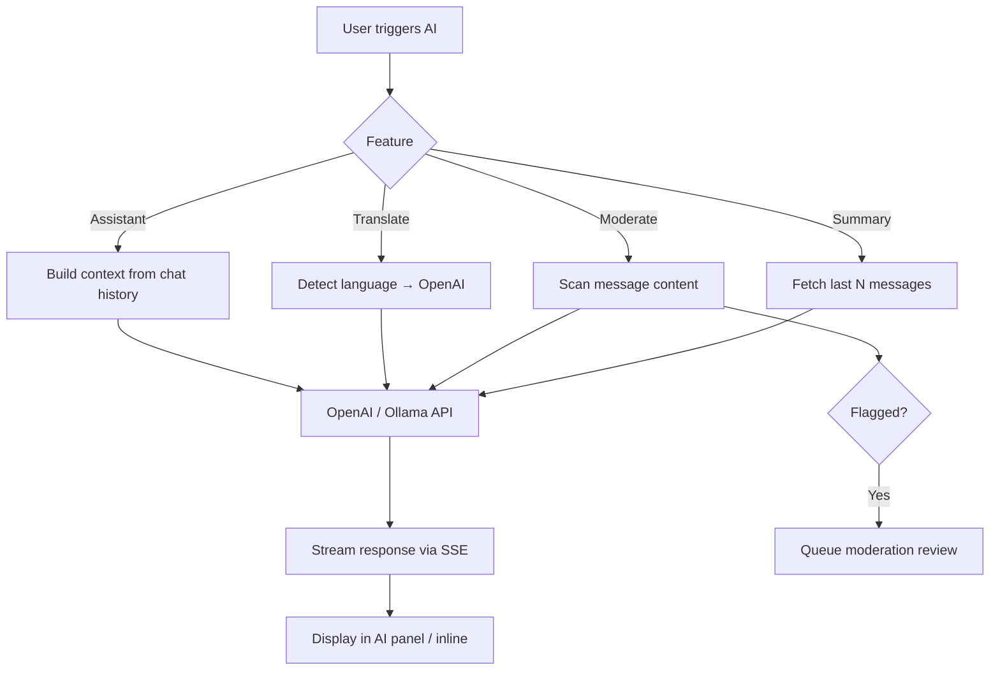

# Enterprise Communication Platform — System Architecture

> **Stack:** Laravel 12 API · React/Next.js Frontend · MySQL · Redis · WebSockets · Docker · Nginx · AWS · OpenAI/Ollama  
> **Current MVP:** Laravel monolith + Blade/Alpine.js (Phase 0) → Microservices (Phase 4)

---

## Table of Contents

1. [Executive Summary](#1-executive-summary)
2. [System Architecture Overview](#2-system-architecture-overview)
3. [Microservices Architecture](#3-microservices-architecture)
4. [Database Design & ER Diagram](#4-database-design--er-diagram)
5. [API Structure](#5-api-structure)
6. [Folder Structure](#6-folder-structure)
7. [UI/UX Design Flow](#7-uiux-design-flow)
8. [User Journey Flow](#8-user-journey-flow)
9. [Admin Flow](#9-admin-flow)
10. [Communication Flow](#10-communication-flow)
11. [WebSocket Flow](#11-websocket-flow)
12. [Notification Flow](#12-notification-flow)
13. [AI Agent Flow](#13-ai-agent-flow)
14. [Security Architecture](#14-security-architecture)
15. [Deployment Architecture](#15-deployment-architecture)
16. [AWS/Azure Infrastructure](#16-awsazure-infrastructure)
17. [Scalability Plan](#17-scalability-plan)
18. [Implementation Roadmap](#18-implementation-roadmap)

---

## 1. Executive Summary

This platform unifies messaging (WhatsApp), channels (Telegram), communities (Discord), workspaces (Slack/Teams), and AI collaboration into one enterprise-grade system.

| Layer       | Technology                               | Purpose                      |
| ----------- | ---------------------------------------- | ---------------------------- |
| Frontend    | Next.js 15 + React 19                    | Web, PWA, admin dashboard    |
| Mobile      | React Native / Flutter                   | iOS & Android clients        |
| API Gateway | Nginx + Kong/AWS API Gateway             | Rate limiting, auth, routing |
| Core API    | Laravel 12 (modular monolith → services) | Business logic               |
| Real-time   | Laravel Reverb / Soketi + Redis Pub/Sub  | WebSockets                   |
| Database    | MySQL 8 (primary) + Redis (cache/queue)  | Persistence                  |
| Search      | Meilisearch / Elasticsearch              | Message & user search        |
| Media       | S3 + CloudFront CDN                      | Files, images, video         |
| AI          | OpenAI API + Ollama (self-hosted)        | Assistants, moderation       |
| Infra       | Docker + AWS ECS/EKS                     | Container orchestration      |

---

## 2. System Architecture Overview

```
┌─────────────────────────────────────────────────────────────────────────────┐
│                              CLIENT LAYER                                    │
│  ┌──────────┐  ┌──────────┐  ┌──────────┐  ┌──────────┐  ┌──────────────┐  │
│  │ Web App  │  │ Mobile   │  │ Desktop  │  │ Admin    │  │ AI Widget    │  │
│  │ Next.js  │  │ RN/Flut  │  │ Electron │  │ Panel    │  │ Embedded     │  │
│  └────┬─────┘  └────┬─────┘  └────┬─────┘  └────┬─────┘  └──────┬───────┘  │
└───────┼─────────────┼─────────────┼─────────────┼───────────────┼───────────┘
        │             │             │             │               │
        └─────────────┴─────────────┴──────┬──────┴───────────────┘
                                           │ HTTPS / WSS
┌──────────────────────────────────────────▼──────────────────────────────────┐
│                           EDGE & GATEWAY LAYER                             │
│  ┌─────────────┐  ┌──────────────┐  ┌─────────────┐  ┌─────────────────┐  │
│  │ CloudFront  │  │ WAF + Shield │  │ Load Balancer│  │ API Gateway     │  │
│  │ CDN         │  │ DDoS Protect │  │ (ALB/NLB)   │  │ Rate Limiting   │  │
│  └─────────────┘  └──────────────┘  └─────────────┘  └─────────────────┘  │
└──────────────────────────────────────────┬──────────────────────────────────┘
                                           │
┌──────────────────────────────────────────▼──────────────────────────────────┐
│                          APPLICATION LAYER                                   │
│  ┌─────────────────────────────────────────────────────────────────────┐    │
│  │                    Laravel 12 API (Modular Monolith)                 │    │
│  │  ┌─────────┐ ┌─────────┐ ┌──────────┐ ┌─────────┐ ┌─────────────┐ │    │
│  │  │ Auth    │ │ Chat    │ │ Community│ │ Channel │ │ AI Service  │ │    │
│  │  │ Module  │ │ Module  │ │ Module   │ │ Module  │ │ Module      │ │    │
│  │  └─────────┘ └─────────┘ └──────────┘ └─────────┘ └─────────────┘ │    │
│  │  ┌─────────┐ ┌─────────┐ ┌──────────┐ ┌─────────┐ ┌─────────────┐ │    │
│  │  │ Media   │ │ Calls   │ │ Status   │ │ Business│ │ Admin       │ │    │
│  │  │ Module  │ │ Module  │ │ Module   │ │ Module  │ │ Module      │ │    │
│  │  └─────────┘ └─────────┘ └──────────┘ └─────────┘ └─────────────┘ │    │
│  └─────────────────────────────────────────────────────────────────────┘    │
│  ┌──────────────────┐  ┌──────────────────┐  ┌──────────────────────────┐  │
│  │ Reverb WebSocket │  │ Queue Workers    │  │ Scheduler (Cron)         │  │
│  │ Server           │  │ (Horizon)        │  │ Status cleanup, reports  │  │
│  └──────────────────┘  └──────────────────┘  └──────────────────────────┘  │
└──────────────────────────────────────────┬──────────────────────────────────┘
                                           │
┌──────────────────────────────────────────▼──────────────────────────────────┐
│                            DATA LAYER                                        │
│  ┌──────────┐  ┌──────────┐  ┌────────────┐  ┌──────────┐  ┌───────────┐  │
│  │ MySQL    │  │ Redis    │  │ S3 Storage │  │ Meili    │  │ Audit Log │  │
│  │ Primary  │  │ Cache/Q  │  │ + CDN      │  │ Search   │  │ (S3/ES)   │  │
│  └──────────┘  └──────────┘  └────────────┘  └──────────┘  └───────────┘  │
└─────────────────────────────────────────────────────────────────────────────┘
```

---

## 3. Microservices Architecture

### Phase 0 (Current): Modular Monolith

All modules in one Laravel app with clear boundaries (`app/Modules/*`).

### Phase 4 (Production): Extracted Services

```
                    ┌─────────────────┐
                    │   API Gateway   │
                    └────────┬────────┘
         ┌───────────────────┼───────────────────┐
         │                   │                   │
    ┌────▼────┐        ┌─────▼─────┐      ┌─────▼─────┐
    │ Auth    │        │ Chat      │      │ Media     │
    │ Service │        │ Service   │      │ Service   │
    └────┬────┘        └─────┬─────┘      └─────┬─────┘
         │                   │                   │
    ┌────▼────┐        ┌─────▼─────┐      ┌─────▼─────┐
    │ User    │        │ Community │      │ Call      │
    │ Service │        │ Service   │      │ Service   │
    └─────────┘        └───────────┘      └───────────┘
         │                   │                   │
         └───────────────────┼───────────────────┘
                             │
              ┌──────────────▼──────────────┐
              │     Message Bus (Redis)     │
              │  Events: message.sent,      │
              │  user.online, call.started  │
              └─────────────────────────────┘
```

| Service                  | Responsibility                     | DB                       | Communication |
| ------------------------ | ---------------------------------- | ------------------------ | ------------- |
| **auth-service**         | OTP, OAuth, 2FA, sessions, devices | users, sessions, devices | REST + JWT    |
| **chat-service**         | 1:1, groups, messages, reactions   | messages, groups         | REST + WS     |
| **community-service**    | Communities, roles, moderation     | communities              | REST          |
| **channel-service**      | Broadcast channels, subscribers    | channels                 | REST + WS     |
| **media-service**        | Upload, compress, CDN URLs         | media_files              | REST + S3     |
| **call-service**         | WebRTC signaling, rooms            | calls, rooms             | WS + REST     |
| **notification-service** | Push, email, in-app                | notifications            | Queue events  |
| **ai-service**           | Translation, summary, moderation   | ai_logs                  | REST + Queue  |
| **admin-service**        | Dashboard, reports, moderation     | audit_logs               | REST          |

---

## 4. Database Design & ER Diagram

### Core Tables (Phase 0 — Implemented)

```
┌──────────────┐       ┌──────────────┐       ┌──────────────┐
│    users     │       │   messages   │       │    groups    │
├──────────────┤       ├──────────────┤       ├──────────────┤
│ id           │◄──┐   │ id           │   ┌──►│ id           │
│ name         │   │   │ sender_id    │───┘   │ name         │
│ email        │   │   │ receiver_id  │───┐   │ admin_id     │──►users
│ phone        │   └───│ group_id     │───┼──►│ avatar       │
│ password     │       │ channel_id   │   │   │ description  │
│ avatar       │       │ community_id │   │   └──────┬───────┘
│ about        │       │ reply_to_id  │   │          │
│ is_online    │       │ message      │   │   ┌──────▼───────┐
│ last_seen    │       │ type         │   │   │group_members │
└──────┬───────┘       │ status       │   │   ├──────────────┤
       │               │ file_path    │   └───│ group_id     │
       │               │ deleted_at   │       │ user_id      │
       │               └──────────────┘       └──────────────┘
       │
┌──────▼───────┐  ┌──────────────┐  ┌──────────────┐
│   channels   │  │ communities  │  │   statuses   │
├──────────────┤  ├──────────────┤  ├──────────────┤
│ id           │  │ id           │  │ id           │
│ name         │  │ name         │  │ user_id      │
│ owner_id     │  │ owner_id     │  │ type         │
│ description  │  │ description  │  │ media_path   │
└──────┬───────┘  └──────┬───────┘  │ expires_at   │
       │                 │          └──────────────┘
┌──────▼───────┐  ┌──────▼───────┐
│channel_subs  │  │community_    │
│              │  │members/groups│
└──────────────┘  └──────────────┘
```

### Extended Tables (Phase 1–3)

| Table                   | Key Columns                                                       | Purpose                 |
| ----------------------- | ----------------------------------------------------------------- | ----------------------- |
| `devices`               | user_id, device_token, platform, verified_at                      | Multi-device            |
| `otp_codes`             | phone, code, expires_at                                           | Mobile OTP login        |
| `two_factor_secrets`    | user_id, secret, recovery_codes                                   | 2FA                     |
| `login_history`         | user_id, ip, device, location                                     | Security audit          |
| `chat_preferences`      | user_id, target_type, target_id, is_pinned, is_muted, is_archived | WhatsApp-like prefs     |
| `starred_messages`      | user_id, message_id                                               | Starred messages        |
| `message_reactions`     | message_id, user_id, emoji                                        | Reactions               |
| `message_reads`         | message_id, user_id, read_at                                      | Group read receipts     |
| `polls`                 | message_id, question, options, expires_at                         | Polls                   |
| `poll_votes`            | poll_id, user_id, option_index                                    | Poll votes              |
| `scheduled_messages`    | message payload, send_at                                          | Scheduled send          |
| `calls`                 | caller_id, callee_id, type, status, started_at                    | Voice/video             |
| `call_participants`     | call_id, user_id, joined_at                                       | Group calls             |
| `roles` / `permissions` | Spatie RBAC                                                       | Admin & community roles |
| `audit_logs`            | actor_id, action, metadata                                        | Compliance              |
| `ai_conversations`      | user_id, context, model                                           | AI assistant            |
| `tickets`               | user_id, subject, status                                          | Customer support        |
| `products` / `orders`   | CRM & commerce                                                    | Business module         |

### Message Type Enum

```
text | image | video | audio | file | system | announcement | poll | location | contact
```

---

## 5. API Structure

### Base URL

```
Production: https://api.yourplatform.com/v1
WebSocket:  wss://ws.yourplatform.com
```

### Authentication

```
POST   /auth/register          Email/phone registration
POST   /auth/login             Email + password
POST   /auth/otp/send          Send OTP to phone
POST   /auth/otp/verify        Verify OTP → JWT
POST   /auth/social/{provider} Google, Apple, Facebook
POST   /auth/2fa/enable        Enable TOTP 2FA
POST   /auth/2fa/verify        Verify 2FA code
POST   /auth/logout            Revoke session
GET    /auth/devices           List linked devices
DELETE /auth/devices/{id}      Unlink device
GET    /auth/login-history     Login audit trail
```

### Chat

```
GET    /chats                  Chat list with previews
POST   /chats/send             Send message (1:1)
POST   /chats/group/send       Send group message
GET    /chats/{id}/messages    Paginated messages
POST   /chats/seen/{userId}    Mark as read
POST   /chats/typing           Typing indicator
PUT    /messages/{id}          Edit message
DELETE /messages/{id}          Delete for me
DELETE /messages/{id}/everyone Delete for everyone
POST   /messages/{id}/react    Add reaction
POST   /messages/{id}/star     Star message
GET    /messages/starred       Starred messages
GET    /messages/search        Full-text search
POST   /messages/forward       Forward message
POST   /messages/pin           Pin in chat
POST   /messages/schedule      Schedule message
```

### Groups & Communities

```
POST   /groups                 Create group
PUT    /groups/{id}            Update group
POST   /groups/{id}/members    Add member
DELETE /groups/{id}/members/{userId}
POST   /communities            Create community
POST   /communities/{id}/announce  Announcement
GET    /communities/{id}/announcements
```

### Channels

```
GET    /channels               My channels
POST   /channels               Create channel
POST   /channels/{id}/subscribe
POST   /channels/send          Post to channel
GET    /channels/discover      Public channels
```

### Media

```
POST   /media/upload           Multipart upload → CDN URL
GET    /media/{id}             Signed download URL
```

### Status

```
GET    /status                 Contact statuses
POST   /status                 Create status
DELETE /status/{id}
POST   /status/{id}/view       Mark viewed
```

### AI

```
POST   /ai/chat                AI assistant conversation
POST   /ai/translate           Translate message
POST   /ai/summarize           Summarize chat thread
POST   /ai/smart-reply         Suggested replies
POST   /ai/moderate            Content moderation
POST   /ai/transcribe          Voice to text
```

### Admin

```
GET    /admin/users            User management
GET    /admin/analytics        Dashboard metrics
GET    /admin/reports          Content reports
POST   /admin/moderate/{id}    Take moderation action
GET    /admin/health           System health
```

### Response Format

```json
{
    "success": true,
    "data": {},
    "meta": { "page": 1, "per_page": 20, "total": 100 },
    "errors": null
}
```

---

## 6. Folder Structure

### Laravel API (Target Structure)

```
app/
├── Modules/
│   ├── Auth/
│   │   ├── Actions/          LoginUser, SendOtp, VerifyOtp
│   │   ├── Http/Controllers/
│   │   ├── Http/Requests/
│   │   ├── Models/
│   │   └── Services/
│   ├── Chat/
│   │   ├── Actions/          SendMessage, DeleteMessage
│   │   ├── Events/           MessageSent, TypingIndicator
│   │   ├── Http/Resources/   MessageResource
│   │   └── Services/         ChatService, EncryptionService
│   ├── Community/
│   ├── Channel/
│   ├── Media/
│   ├── Call/
│   ├── Status/
│   ├── AI/
│   ├── Business/
│   └── Admin/
├── Http/Middleware/
└── Providers/
database/migrations/
routes/
├── api/v1/auth.php
├── api/v1/chat.php
├── api/v1/channels.php
└── channels.php              WebSocket auth
```

### Next.js Frontend (Target)

```
src/
├── app/                      App Router pages
│   ├── (auth)/login/
│   ├── (main)/chats/
│   ├── (main)/channels/
│   ├── (main)/communities/
│   ├── (main)/status/
│   └── admin/
├── components/
│   ├── chat/                 MessageBubble, ChatList, InputBar
│   ├── channels/
│   ├── ui/                   shadcn/ui components
│   └── layout/               Sidebar, Header
├── hooks/                    useChat, useWebSocket, useAuth
├── lib/                      api client, echo, utils
├── stores/                   Zustand state
└── types/
```

---

## 7. UI/UX Design Flow

### Layout (WhatsApp Web Pattern)

```
┌────┬────────────────┬──────────────────────────────────────┐
│Nav │  Chat List     │  Active Chat / Channel / Community   │
│Rail│  ───────────   │  ─────────────────────────────────   │
│    │  Search        │  Header: Avatar, Name, Actions       │
│ 💬 │  Filters       │  Messages Area (scroll)              │
│ 📷 │  Chat items    │  Reply bar / Media preview           │
│ 📢 │                │  Input: Emoji, Attach, Mic, Send     │
│ 👥 │                │                                      │
│ ⚙️ │                │  [Profile panel slides from right]   │
└────┴────────────────┴──────────────────────────────────────┘
```

### Design Tokens

| Token         | Light     | Dark      |
| ------------- | --------- | --------- |
| Primary       | `#00a884` | `#00a884` |
| Background    | `#f0f2f5` | `#111b21` |
| Chat BG       | `#efeae2` | `#0b141a` |
| Bubble (sent) | `#d9fdd3` | `#005c4b` |
| Bubble (recv) | `#ffffff` | `#202c33` |
| Text primary  | `#111b21` | `#e9edef` |

### Key Screens

1. Login (OTP / Email / Social)
2. Chat list with filters (All, Unread, Favorites, Groups, Communities)
3. 1:1 chat with ticks, reply, reactions
4. Group chat with member list
5. Channel broadcast view
6. Community hub with announcement groups
7. Status viewer (stories)
8. Settings (Account, Privacy, Notifications, Linked Devices)
9. Admin dashboard

---

## 8. User Journey Flow



---

## 9. Admin Flow



| Role            | Permissions                  |
| --------------- | ---------------------------- |
| Super Admin     | Full system access           |
| Moderator       | Content review, user suspend |
| Community Admin | Own community only           |
| Channel Owner   | Own channel only             |
| User            | Standard chat features       |

---

## 10. Communication Flow

### 1:1 Message Send

```
User A → POST /chat/send → ChatController
       → Save to MySQL (messages)
       → Broadcast MessageSent → Reverb → chat.{receiverId}
       → If receiver online → status = delivered
       → Receiver opens chat → markSeen → status = seen
       → Broadcast MessageStatusUpdated → chat.{senderId}
```

### Group Message

```
User → POST /chat/group/send → Verify membership
     → Save message (group_id set)
     → Broadcast GroupMessageSent → group.{groupId}
     → All members' clients receive via Echo
     → Polling fallback: GET /chat/global-new/{afterId}
```

---

## 11. WebSocket Flow



### Channels

| Channel                | Type     | Members                      |
| ---------------------- | -------- | ---------------------------- |
| `chat.{userId}`        | Private  | User + conversation partners |
| `group.{groupId}`      | Private  | Group members only           |
| `channel.{channelId}`  | Private  | Subscribers                  |
| `online`               | Presence | All authenticated users      |
| `App.Models.User.{id}` | Private  | Single user notifications    |

---

## 12. Notification Flow

```
Event (message.sent)
  → NotificationService
  → Check user preferences (muted? online?)
  → If offline:
      → FCM/APNs push notification
      → Email digest (optional)
  → If online but different chat:
      → In-app badge + browser Notification API
  → Queue job (SendPushNotification)
  → Redis queue → Worker → Firebase Admin SDK
```

---

## 13. AI Agent Flow



| Feature        | Model       | Latency Target |
| -------------- | ----------- | -------------- |
| Smart Reply    | gpt-4o-mini | < 500ms        |
| Translation    | gpt-4o      | < 1s           |
| Summary        | gpt-4o      | < 3s           |
| Moderation     | gpt-4o-mini | < 500ms        |
| Voice-to-text  | whisper-1   | < 2s           |
| Local (Ollama) | llama3      | Self-hosted    |

---

## 14. Security Architecture

```
┌─────────────────────────────────────────────────────────┐
│                    SECURITY LAYERS                       │
├─────────────────────────────────────────────────────────┤
│ Edge: WAF, DDoS, TLS 1.3, HSTS                          │
│ Auth: JWT (short) + Refresh tokens, 2FA TOTP            │
│ Session: Database sessions, device fingerprinting         │
│ E2E: Signal Protocol (Phase 3) — client-side keys       │
│ API: Rate limiting (60/min), CORS, CSRF (web)         │
│ Data: bcrypt passwords, encrypted tokens at rest        │
│ Media: Signed S3 URLs, virus scan (ClamAV)              │
│ Audit: All admin actions logged                         │
│ RBAC: Spatie permissions per role                       │
└─────────────────────────────────────────────────────────┘
```

### E2E Encryption (Phase 3)

- X25519 key exchange per conversation
- AES-256-GCM for message content
- Server stores only encrypted blobs
- Key rotation on device unlink

---

## 15. Deployment Architecture

```
┌──────────────────────────────────────────────────────────────┐
│                         AWS VPC                               │
│  ┌─────────────────────────────────────────────────────────┐ │
│  │ Public Subnet                                            │ │
│  │  ALB → Nginx (ECS) → Laravel API (ECS x N)              │ │
│  │  ALB → Reverb WebSocket (ECS)                           │ │
│  │  CloudFront → S3 (static + media)                       │ │
│  └─────────────────────────────────────────────────────────┘ │
│  ┌─────────────────────────────────────────────────────────┐ │
│  │ Private Subnet                                           │ │
│  │  RDS MySQL (Multi-AZ)                                   │ │
│  │  ElastiCache Redis                                      │ │
│  │  ECS Workers (Horizon)                                  │ │
│  │  ECS Scheduler                                          │ │
│  └─────────────────────────────────────────────────────────┘ │
└──────────────────────────────────────────────────────────────┘
```

### Docker Compose (Development)

```yaml
services:
  app:        # Laravel PHP-FPM
  nginx:      # Reverse proxy
  reverb:     # WebSocket server
  worker:     # Queue worker
  mysql:      # Database
  redis:      # Cache + queue + pub/sub
  meilisearch:# Full-text search
```

---

## 16. AWS/Azure Infrastructure

### AWS (Recommended)

| Service           | Use                      |
| ----------------- | ------------------------ |
| ECS Fargate       | API, Reverb, workers     |
| RDS MySQL 8       | Primary database         |
| ElastiCache Redis | Cache, queues, pub/sub   |
| S3 + CloudFront   | Media + static assets    |
| SES               | Transactional email      |
| SNS + FCM         | Push notifications       |
| WAF + Shield      | Security                 |
| CloudWatch        | Monitoring & alerts      |
| Secrets Manager   | API keys, DB credentials |
| Route 53          | DNS                      |

### Azure Alternative

| AWS         | Azure Equivalent             |
| ----------- | ---------------------------- |
| ECS         | Azure Container Apps         |
| RDS         | Azure Database for MySQL     |
| ElastiCache | Azure Cache for Redis        |
| S3          | Azure Blob Storage           |
| CloudFront  | Azure CDN                    |
| SES         | Azure Communication Services |

### Estimated Monthly Cost (10K MAU)

| Tier                     | Cost         |
| ------------------------ | ------------ |
| MVP (Railway/single VPS) | $20–50       |
| Growth (AWS small)       | $200–500     |
| Scale (AWS multi-AZ)     | $1,500–5,000 |
| Enterprise               | $10,000+     |

---

## 17. Scalability Plan

| Metric                | Phase 0      | Phase 2       | Phase 4            |
| --------------------- | ------------ | ------------- | ------------------ |
| Users                 | 1K           | 50K           | 1M+                |
| Messages/day          | 10K          | 1M            | 100M+              |
| WebSocket connections | 100          | 5K            | 100K+              |
| API servers           | 1            | 3             | Auto-scale 10–50   |
| DB                    | Single MySQL | Read replicas | Sharded by user_id |
| Cache                 | Database     | Redis         | Redis Cluster      |
| Media                 | Local disk   | S3 + CDN      | Multi-region CDN   |

### Scaling Strategies

1. **Horizontal API scaling** — Stateless Laravel behind ALB
2. **Read replicas** — Chat history reads from replica
3. **Message partitioning** — Shard messages by `conversation_id`
4. **Redis pub/sub** — Reverb scales with Redis backplane
5. **CDN** — All media off origin
6. **Queue workers** — Scale Horizon workers independently
7. **Connection pooling** — PgBouncer-style for MySQL

---

## 18. Implementation Roadmap

### Phase 0 — MVP (Current) ✅ ~70%

- [x] Email auth (login/register)
- [x] 1:1 chat (text, media, ticks, typing)
- [x] Groups (text, admin actions)
- [x] Channels (CRUD, subscribe, post)
- [x] Communities (CRUD, announcements)
- [x] Status/Stories (24h expiry)
- [x] Profile management
- [x] WebSocket (DMs via Reverb)
- [ ] Pin/mute/archive persistence ← **In progress**
- [ ] Reply, star, delete (backend) ← **In progress**
- [ ] Group media upload
- [ ] Password reset flow

### Phase 1 — WhatsApp Parity (4–6 weeks)

- OTP login (Twilio/MSG91)
- Message edit & delete for everyone
- Reactions & polls
- Group read receipts
- Voice messages
- In-chat & global search (Meilisearch)
- Push notifications (FCM)
- Chat backup/export

### Phase 2 — Telegram/Discord Features (6–8 weeks)

- Public/private channels with verification
- Community roles & moderation tools
- Scheduled messages
- Auto-delete messages
- Live location sharing
- Message forwarding with media
- Next.js frontend migration

### Phase 3 — Calls & Enterprise (8–12 weeks)

- WebRTC voice/video calls (LiveKit/Janus)
- Group calls & screen sharing
- Meeting rooms
- 2FA & device management
- E2E encryption (Signal)
- RBAC admin panel
- Audit logs & compliance

### Phase 4 — AI & Business (12–16 weeks)

- AI assistant, translation, summary
- AI moderation & community manager
- CRM, tickets, product catalog
- Payment gateway integration
- Microservices extraction
- Kubernetes deployment
- Multi-region AWS

### Phase 5 — Production Hardening

- Load testing (k6)
- Penetration testing
- GDPR compliance
- SLA monitoring (99.9%)
- Disaster recovery
- Auto-scaling policies

---

## Quick Reference — Current Routes (Phase 0)

See `routes/web.php` for all endpoints. Key groups:

- `/chat/*` — Messaging
- `/channels/*` — Channel system
- `/communities/*` — Community system
- `/status/*` — Stories
- `/users`, `/profile` — Contacts & profile

---

_Document version: 1.0 | Last updated: June 2026_
